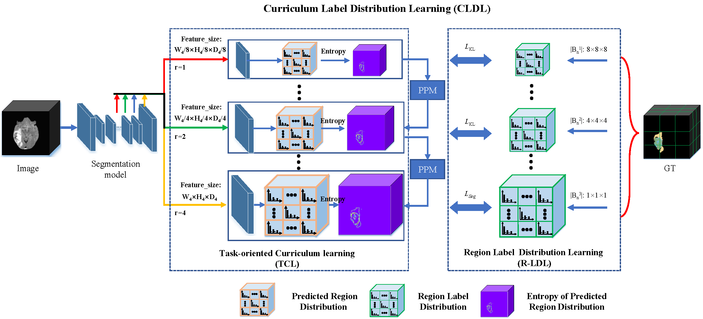

# CLDL-pytorch

Official Pytorch Code for the paper ["Curriculum label distribution learning for imbalanced medical image segmentation"](https://www.sciencedirect.com/science/article/abs/pii/S1361841523001718) ,  presented  at  Medical Image Analysis (MedIA) 2023.


# Introduction

Label distribution learning (LDL) has the potential to resolve boundary ambiguity in semantic segmentation tasks. However, existing LDL-based segmentation methods suffer from severe label distribution imbalance: the ambiguous label distributions contain a small fraction of the data, while the unambiguous label distributions occupy the majority of the data. The imbalanced label distributions induce model-biased distribution learning and make it challenging to accurately predict ambiguous pixels. In this paper, we propose a curriculum label distribution learning (CLDL) framework to address the above data imbalance problem by performing a novel task-oriented curriculum learning strategy. Firstly, the region label distribution learning (R-LDL) is proposed to construct more balanced label distributions and improves the imbalanced model learning. Secondly, a novel learning curriculum (TCL) is proposed to enable easy-to-hard learning in LDL-based segmentation by decomposing the segmentation task into multiple label distribution estimation tasks. Thirdly, the prior perceiving module (PPM) is proposed to effectively connect easy and hard learning stages based on the priors generated from easier stages. Benefiting from the balanced label distribution construction and prior perception, the proposed CLDL effectively conducts a curriculum learning-based LDL and significantly improves the imbalanced learning. We evaluated the proposed CLDL using the publicly available BRATS2018 and MM-WHS2017 datasets. The experimental results demonstrate that our method significantly improves different segmentation metrics compared to many state-of-the-art methods. 

<p align="center">
  
</p>

### Prerequisites:

- Python 3.6
- Pytorch 1.8 

# How to Us this Code

### Clone this repository:

```bash
git clone git@github.com:PerceptionComputingLab/CLDL.git
cd CLDL/CLDL
```


### Training :

 (1) Set hyper-parameters in the configuration file, config.py 

 (2) Training.

```bash
python train_UNetLDLNew 
```

### Testing :

```bash 
python test_ldl.py
```

### Acknowledgement:

Our code is inspired from <a href="https://github.com/MIC-DKFZ/nnUNet">nnUNet</a>

# Citation:

```bash 
@article{li2023curriculum,
  title={Curriculum label distribution learning for imbalanced medical image segmentation},
  author={Li, Xiangyu and Luo, Gongning and Wang, Wei and Wang, Kuanquan and Li, Shuo},
  journal={Medical Image Analysis},
  volume={89},
  pages={102911},
  year={2023},
  publisher={Elsevier}
}
```
